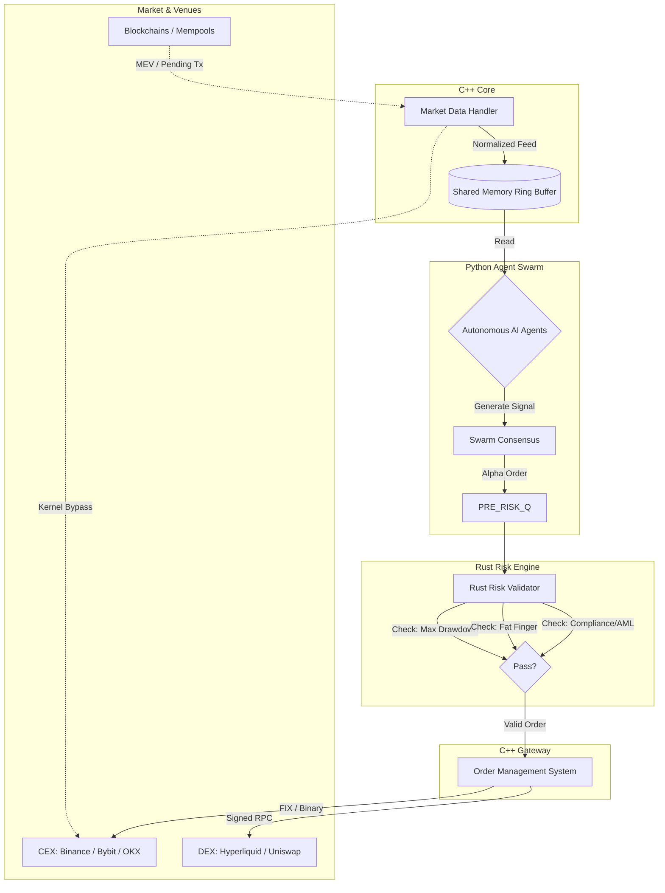
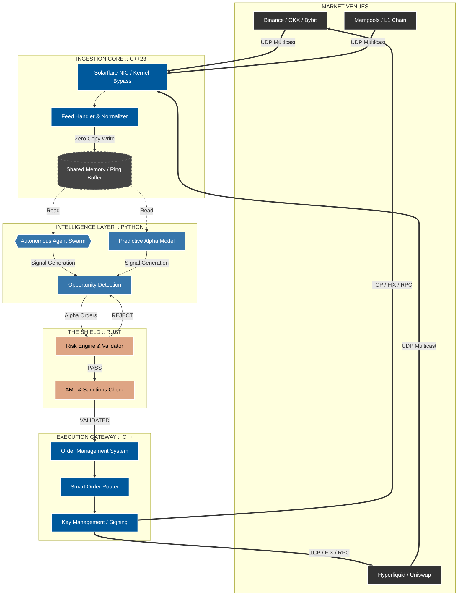
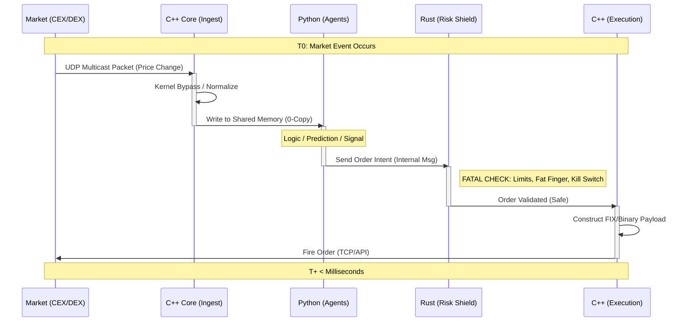

<div align="center">


█░░ █▀█ █▀▀ █ █▀▀   █░█ █▀▀ █▀▄ █▀▀ █▀▀
█▄▄ █▄█ █▄█ █ █▄▄   █▀█ ██▄ █▄▀ █▄█ ██▄


# **LOGIC HEDGE**
### *Building resilient portfolios that act as a natural hedge on the future.*

<br>

[](https://isocpp.org)
[](https://rust-lang.org)
[](https://python.org)
[](https://web3py.readthedocs.io/)
[](LICENSE)

</div>

---

## **1. THE LOGIC HEDGE ADVANTAGE**

**Logic Hedge** is a vanguard collective of human experts and Autonomous AI Agents operating at the leading edge of agentic capital markets. We do not merely predict the future; we systematically allocate capital into the foundational systems that will power the Agentic Economy.

We view the transition to autonomous economic actors not as a possibility, but as an inevitability. Our mandate is to identify, validate, and channel liquidity into the technological pillars of tomorrow, creating a "natural hedge" against the displacement of legacy systems.

### **The Philosophy: Pre-emptive Positioning**

We reject the notion of predatory "front-running." Instead, we utilize **Pre-emptive Positioning**. By analyzing protocol-level intelligence and cross-disciplinary technological trends, our systems identify order flow imbalances and emerging logical manifests before they register on the retail radar. We are not chasing the market; we are positioning ourselves where the market effectively must go based on the logic of technological evolution.

---

## **2. SYSTEM ARCHITECTURE & TECHNICAL FOUNDATION**

To operate across centralized (CEX) and decentralized (DEX) venues with institutional efficacy, we employ a polyglot architecture. We utilize specific languages for their unique strengths—Python for flexibility, Rust for safety, and C++ for raw speed.

### **The Stack**

| Component | Language | Technical Context |
|-----------|-----------|-------------------|
| **Execution Gateway** | C++ (C++23) | The "Hot Path." Handles market data ingestion (UDP Multicast) and order transmission. Leverages template metaprogramming and kernel-bypass networking (Solarflare/OpenOnload) to minimize latency to single-digit microseconds. |
| **The Shield (Risk)** | Rust | Sits between the Strategy and the Execution Gateway. Enforces strict capital limits, max-position sizing, and fat-finger checks. Rust's memory safety guarantees zero-cost abstractions without the unpredictability of Garbage Collection pauses. |
| **Agent Swarm** | Python | The orchestration layer for Alpha Generation. Hosts our AI Swarms, Reinforcement Learning models, and predictive agents. Connects via PyO3/Pybind11 to the core system. |
| **System Stability** | Elixir | Manages the lifecycle of thousands of concurrent agent processes, utilizing OTP for fault tolerance and "Let it Crash" resilience in distributed environments. |
| **On-Chain Logic** | Solidity / Yul | Smart contract interaction, MEV-protected routing, and atomic execution on EVM-compatible chains. |

### **The "Tier 1" Hardware Standard**

Software is only as fast as the physics allowing it to run. This repository assumes an environment built on:

- **Colocation**: Servers physically located in proximity to matching engines (e.g., NY4, AWS ap-northeast-1 for specific exchanges)
- **Precision Time**: PTP (IEEE 1588) synchronization for nanosecond-level log accuracy
- **Microwave Arrays**: Utilization of microwave networks over fiber for long-haul data transmission to gain a ~50% speed advantage (speed of light in air vs. glass)

---

## **3. ARCHITECTURE DIAGRAM**

The following diagram illustrates the Standard Tier 1 Design Pattern implemented by Logic Hedge. Note the Rust Risk Engine acting as the critical "airlock" between the probabilistic world of Python AI and the deterministic world of C++ Execution.




4. STRATEGIC PILLARS
I. Agentic Capital Allocation

We deploy a swarm of AI agents to manage a portfolio of 300+ digital assets. These agents use Reinforcement Learning to adapt to regime changes (volatility vs. trending) dynamically.
II. Technological Foresight Positioning

A discretionary and algorithmic hybrid strategy. We invest in the infrastructure that enables the Agentic Economy. If AI agents are the future workforce, we invest in the payments rails, compute marketplaces, and storage layers they will utilize.
III. Multi-Venue Execution Excellence

    Hyperliquid Perpetuals: High-throughput trading on decentralized derivatives

    CEX-DEX Arbitrage: Capturing price inefficiencies between centralized books and on-chain AMMs

    Smart Order Routing (SOR): Splitting "Parent" orders into thousands of "Child" orders across venues to minimize slippage and hide intent

5. RESEARCH & SYSTEMS

This repository hosts the technology enabling our research-to-execution pipeline.

    Opportunity Detection: Scanners for pre-market volume spikes and "overbooks" (order book imbalances)

    Social Sentiment Analysis: NLP pipelines processing news and social feeds to detect "irrational exuberance" or panic before price action follows

    Protocol-Level Intelligence: Monitoring mempools for large asset movements and analyzing code commits to identify emerging protocols before mainnet launches

6. COMPLIANCE & RISK MANAGEMENT

You can only blow up once. Our Rust-based Risk Engine is the supreme authority in the system.

    AML Compliance: Automated screening of counterparty wallets against OFAC and sanctions lists

    Kill Switches: Global system halts triggered by volatility thresholds or connectivity loss

    Academic-Grade Analysis: All strategies undergo rigorous Walk-Forward Analysis to prevent overfitting, ensuring our "Edge" is based on market logic, not historical anomalies

<div align="center">
```

   
LOGIC HEDGE
The Inevitable Approach to Futuristic Wealth.

This repository contains proprietary trading systems, algorithms, and research infrastructure powering our investment strategies.
</div> 


## System Architecture







