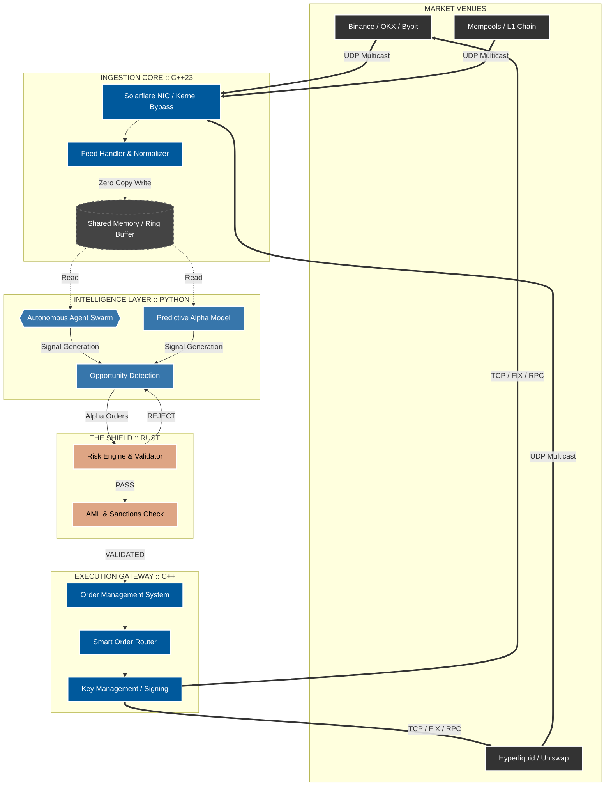
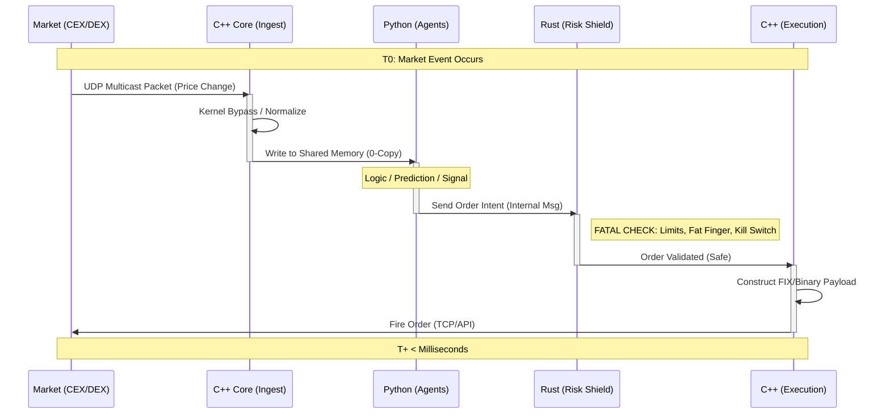

## System Architecture

```mermaid
graph TD
    %% -- Styles --
    classDef cpp fill:#00599C,stroke:#fff,stroke-width:2px,color:white;
    classDef py fill:#3776AB,stroke:#fff,stroke-width:2px,color:white;
    classDef rust fill:#dea584,stroke:#fff,stroke-width:2px,color:black;
    classDef ext fill:#333,stroke:#fff,stroke-width:2px,color:white;
    classDef store fill:#444,stroke:#666,stroke-width:2px,color:white,stroke-dasharray: 5 5;

    %% -- External World --
    subgraph External [MARKET VENUES]
        direction LR
        CEX[Binance / OKX / Bybit]:::ext
        DEX[Hyperliquid / Uniswap]:::ext
        L1[Mempools / L1 Chain]:::ext
    end

    %% -- C++ Ingestion Layer --
    subgraph Ingest [INGESTION CORE :: C++23]
        NIC[Solarflare NIC / Kernel Bypass]:::cpp
        Parser[Feed Handler & Normalizer]:::cpp
        SHM[(Shared Memory / Ring Buffer)]:::store
    end

    %% -- Python Research Layer --
    subgraph Brain [INTELLIGENCE LAYER :: PYTHON]
        Agents{{Autonomous Agent Swarm}}:::py
        ML[Predictive Alpha Model]:::py
        Logic[Opportunity Detection]:::py
    end

    %% -- Rust Risk Layer --
    subgraph Shield [THE SHIELD :: RUST]
        Risk[Risk Engine & Validator]:::rust
        Compliance[AML & Sanctions Check]:::rust
    end

    %% -- C++ Execution Layer --
    subgraph Exec [EXECUTION GATEWAY :: C++]
        OMS[Order Management System]:::cpp
        Signer[Key Management / Signing]:::cpp
        Router[Smart Order Router]:::cpp
    end

    %% -- Connections --
    CEX & DEX & L1 == UDP Multicast ==> NIC
    NIC --> Parser
    Parser -- Zero Copy Write --> SHM
    SHM -. Read .-> Agents & ML
    
    Agents & ML -- Signal Generation --> Logic
    Logic -- Alpha Orders --> Risk
    
    Risk -- REJECT --> Logic
    Risk -- PASS --> Compliance
    Compliance -- VALIDATED --> OMS
    
    OMS --> Router
    Router --> Signer
    Signer == TCP / FIX / RPC ==> CEX & DEX
```

```mermaid
sequenceDiagram
    participant M as Market (CEX/DEX)
    participant C as C++ Core (Ingest)
    participant P as Python (Agents)
    participant R as Rust (Risk Shield)
    participant E as C++ (Execution)

    Note over M, E: T0: Market Event Occurs
    M->>C: UDP Multicast Packet (Price Change)
    activate C
    C->>C: Kernel Bypass / Normalize
    C->>P: Write to Shared Memory (0-Copy)
    deactivate C
    
    activate P
    Note over P: Logic / Prediction / Signal
    P->>R: Send Order Intent (Internal Msg)
    deactivate P
    
    activate R
    Note right of R: FATAL CHECK: Limits, Fat Finger, Kill Switch
    R->>E: Order Validated (Safe)
    deactivate R
    
    activate E
    E->>E: Construct FIX/Binary Payload
    E->>M: Fire Order (TCP/API)
    deactivate E
    Note over M, E: T+ < Milliseconds
```
